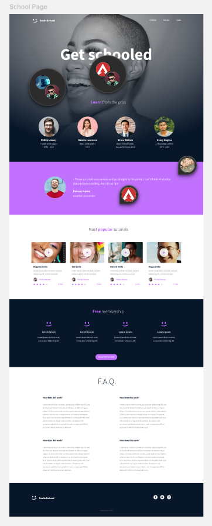

# SmileSchool — CSS advanced

[Existing GitHub Pages site](https://elnara-malikzade-12728.github.io/)

The live site is maintained in the separate `elnara-malikzade-12728.github.io` repository.

This project implements the SmileSchool design using semantic HTML and plain CSS.
It includes a hero with instructor profiles, a testimonial, tutorial cards, membership benefits, frequently asked questions, and a footer.
The layout adapts to smaller screens and uses local images and fonts without external frameworks.

## Task progression

- `task_0`: original HTML and project description.
- `task_1`: stylesheet import.
- `task_2`: header, banner and instructor styling.
- `task_3`: adds testimonial styling.
- `task_4`: adds tutorial card styling.
- `task_5`: adds membership styling.
- `task_6`: adds FAQ styling.
- `task_7`: adds footer styling.
- `task_8`: complete page for publishing.

Open `task_8/index.html` in a browser, or serve this directory with a static HTTP server.
Fonts are stored in this directory; their license is in `FONT-LICENSE.md`.
Registration and login are design elements; no authentication or registration backend is included.
